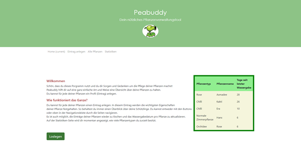
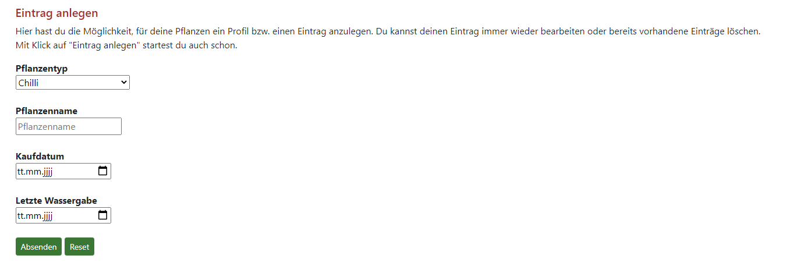
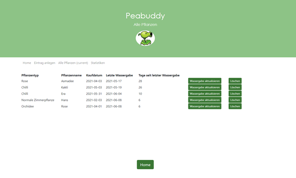
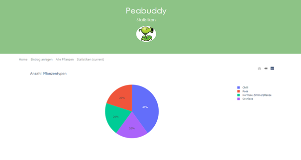

<h1>Peabuddy</h1>

Das Pflanzenverwaltungstool "Peabuddy" wurde im Rahmen der Vorlesung "Python 2" als Projektarbeit entworfen und entwickelt. Die Bearbeitung erfolgte im Zeitraum von März 2021 - Juni 2021.

<h3>Hintergrund und Zweck</h2>

Aus einem persönlichen Wunsch heraus, für die eigenen Pflanzen ein Verwaltungstool zu erstellen, entstand Peabuddy. Kakteen sind günstig in der Anschaffung - entsprechend hoch und genau so schnell ist die durch den Kauf geschuldete "Vermehrung". Zu den Kakti kommen gerne noch Gummibaum und Elefantenfuss dazu und schon hat man einen halben Regenwald bei sich zu Hause. Doch wann kam welche Pflanze in den Besitz? Wann wurde ihr das letzte Mal Wasser gegeben? In diesem Fragenjungle soll Peabuddy nun eine gute Übersicht über die eigenen Pflanzen bieten.

<h3>Konkrete Funktionen</h3>

Konkrete Funktionen bestehen aus:   
  - Eingabe der Pflanzendaten über Formular  
  - Ausgabe der Pflanzendaten (Übersicht)  
  - Speicherung und Anzeige der Einträge  
  - Aktualisierung des Wassergabedatums  
  - Löschung von Einträgen  
  - Anzeigen einer Pie-Chart mit Übersicht aller vorhandener Pflanzentypen  
  - Navigation mittels Buttons sowie einer Navigationsbar (mit Anzeige der gerade aufgerufenen Seite)

<h3>Technische Vorgänge</h3>

 Die Formulardaten werden in ein Dictionary abgelegt, welches wiederum einer Liste übergeben wird. Dies erfolgt für jeden Formulareintrag. Die Eingabe des Formulars kann zurückgesetzt werden (reset).  
Ebenso ist es möglich, dass Listeneinträge wieder gelöscht werden können ("Löschen") und das in den Listeneinträgen das Wassergabedatum auf den aktuellen Tag aktualisiert werden kann. Dies geschieht mithilfe von Timestamps.  Jedem Formulareintrag wird automatisch eine Timestamp hinzugefügt. Klickt ein Benutzer nun auf "Löschen", so werden die Timestamps der Einträge angefordert. Stimmt nun das Timestamp des zu löschenden Eintrags mit einer Timestamp in der JSON-Datei überein, so wird der entsprechende Eintrag mit "remove" entfernt. Der selbe Vorgang bzw. das selbe Konzept wird beim Aktualisieren des Wassergabedatums verwendet. Hier wird jedoch anstelle der Löschung eines Eintrags der entsprechende Listenwert neu überschrieben mit dem aktuellen Tagesdatum (datetime.today().  

Nebst dem Löschen und dem Aktualisieren von Listeneinträgen werden zudem die Tage berechnet, welche seit der letzten Wassergabe vergangen sind. Diese Berechnung erfolgt auch mit datetime.today(), allerdings muss hier vor der eigentlichen Berechnung der Differenz zwischen Wassergabedatum und dem aktuellen Datum eine Umwandlung des letzten Wassergabedatums von einem String zu einem Zahlenwert ("echtes Datum") erfolgen, da sonst keine Berechnung erfolgen kann.  

<h3> Benutzte Programmiersprachen </h3>
Für die Programmierung des vorliegenden Programmes wurden HTML-, Python-, Jinja-, Bootstrap- sowie CSS-Elemente verwendet.

<h3>Tutorial / Wie benutze ich das Programm?</h3>

Das Programm ist so ausgelegt, dass es lokal verwendet wird. Es kann von mehreren Personen genutzt werden. Bei einer Benutzung ab 2 Personen muss jedoch darauf aufgepasst werden, dass nicht ausversehen Listeneinträge gelöscht werden.

<h4>Startseite</h4>

Auf der Startseite wird man Willkommen geheissen und es werden direkt (sofern vorhanden) die bereits eingetragenen Pflanzen mit Pflanzentyp, Pflanzenname und Tage seit letzter Wassergabe sortiert nach dem letzten Wassergabedatum angezeigt. Mit Klick auf den Button "Loslegen" gelangt man nun direkt zur Seite, wo man mit einem Formular einen Eintrag anlegen kann.   

<h4>Eintrag anlegen</h4>
Auf der Seite "Eintrag anlegen" hat man nun die Möglichkeit, im vorhandenen Formular aus bereits vordefinierten Pflanzentypen einen Pflanzentyp auszuwählen, den Pfalnzennamen anzugeben, wann die Pflanze gekauft wurde und wann sie das letzte Mal Wasser erhalten hat. Mit dem Button "Reset" kann der Inhalt des Formulars bereinigt werden, mit Klick auf "Absenden" werden die Daten in einer JSON-Datei gespeichert.
Mit Klick auf den Button "Alle Einträge anzeigen" gelangt der Benutzer auf eine Übersichtsseite "Alle Pflanzen", wo ihm in tabellarischer Form alle seine Pflanzeneinträge angezeigt werden.   

<h4>Alle Pflanzen</h4>
Auf der Seite "Alle Pflanzen" werden nun wie schon erwähnt alle Listeneinträge angezeigt, geordnet nach dem letzten Wassergabedatum. Hier besteht nun die Möglichkeit, dass ein einzelner Listeneintrag gelöscht werden kann oder das Wassergabedatum aktualisiert werden kann. Mit dem aktualisieren des Wassergabedatums werden automatisch die Tage seit der letzten Wassergabe aktualisiert. Die Pflanze, welche am längsten kein Wasser bekommen hat, wird immer zuoberst angezeigt.  

<h4>Statistiken</h4>
Auf der Seite "Statistiken" wird dem Benutzer eine Pie Chart angezeigt, in welcher er sehen kann, was für unterschiedliche Pflanzentypen er insgesamt besitzt. Wenn man über die Grafik "fährt" bzw. mit dem Mauszeiger über ein Kuchenteil fährt, so sieht man gelichzeitig in einem kleinen Pop-Up die Menge (value) an Pflanzen, welche zum entsprechenden Pflanzentyp gehören. Man kann sich die Grafik optional als PNG abspeichern (die entsprechenden Buttons sollten oben recht in der Pie Chart erscheinen.)   

<h3>Kontakt</h3>
Sollten Fragen zum Programm auftauchen, so kann man sich jederzeit an den Github-Account von Irene Kilchenmann (@Atalantana) wenden. 
 
<h2>Viel Spass!</h2>